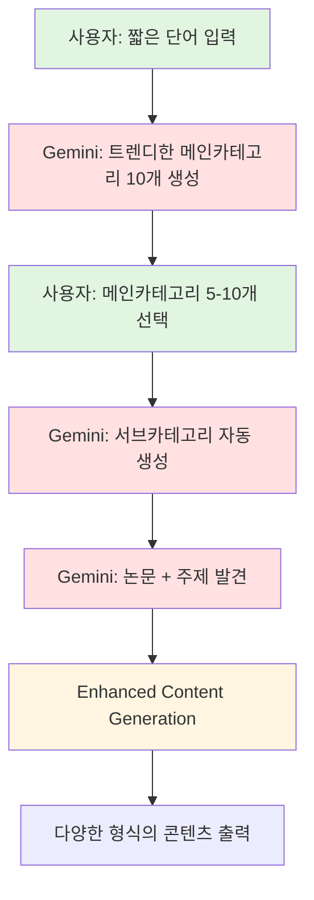

# 🚀 Dynamic AI-Driven Content System v6.0 설계서

## 1. 시스템 개요

### 혁신적 접근법: Full AI-Driven Discovery
- **대주제 입력**: 사용자가 짧은 단어로 관심사 입력
- **AI 메인카테고리 생성**: Gemini가 트렌디한 메인카테고리 자동 발굴
- **AI 서브카테고리 생성**: 선택된 메인카테고리의 세부 주제 AI 생성
- **논문 기반 콘텐츠**: 최종적으로 논문 기반 고품질 콘텐츠 생성

### 핵심 차별점


## 2. Dynamic Discovery System

### 2.1 대주제 → 메인카테고리 생성

```python
class DynamicCategoryDiscovery:
    """AI 기반 동적 카테고리 발견 시스템"""
    
    def discover_main_categories(self, seed_keyword: str, count: int = 10):
        """
        사용자의 짧은 키워드로부터 트렌디한 메인카테고리 생성
        
        Args:
            seed_keyword: 사용자 입력 키워드 (예: "운동", "건강", "피트니스")
            count: 생성할 메인카테고리 수
        """
        
        prompt = f"""
        <thinking>
        사용자가 '{seed_keyword}'에 관심이 있다.
        현재 트렌드와 사람들의 관심사를 고려하여
        독창적이고 매력적인 메인카테고리를 만들어야 한다.
        </thinking>
        
        키워드: {seed_keyword}
        
        위 키워드와 관련하여 현재 사람들이 가장 관심을 가질만한
        트렌디하고 혁신적인 메인카테고리 {count}개를 생성해주세요.
        
        조건:
        1. 각 카테고리는 구체적이면서도 확장 가능해야 함
        2. 20-40대가 관심가질 최신 트렌드 반영
        3. 과학적 연구가 활발한 분야 우선
        4. 이모지 + 매력적인 네이밍 필수
        
        형식:
        🎯 [카테고리명]: [설명] - [왜 지금 HOT한지]
        
        예시:
        🧬 바이오해킹 피트니스: 유전자 맞춤 운동법 - DNA 검사 기반 개인화 운동이 대세
        """
        
        return self.gemini_client.generate_content(prompt)
```

### 2.2 동적 카테고리 예시 (Gemini가 생성할 수 있는 예시)

```
사용자 입력: "운동"

Gemini 생성 메인카테고리:
1. 🧬 바이오해킹 피트니스 - DNA와 혈액검사 기반 맞춤 운동
2. 🤖 AI 퍼스널 트레이닝 - 인공지능이 설계하는 운동 프로그램
3. 🌱 지속가능한 웰니스 - 환경과 건강을 동시에 챙기는 운동법
4. 🧠 뉴로피트니스 - 뇌과학 기반 운동으로 인지능력 향상
5. ⏰ 마이크로 워크아웃 - 5분 이내 초고효율 운동법
6. 🌙 서카디안 리듬 운동 - 생체시계 맞춤 운동 타이밍
7. 💊 운동 약물학 - 합법적 보조제와 운동 시너지
8. 🎮 게이미피케이션 피트니스 - 게임하듯 즐기는 운동
9. 🧘‍♂️ 하이브리드 무브먼트 - 동서양 운동철학의 융합
10. 📊 데이터 드리븐 운동 - 측정가능한 모든 것을 최적화
```

### 2.3 메인카테고리 → 서브카테고리 생성

```python
class SubCategoryGenerator:
    """선택된 메인카테고리의 서브카테고리 자동 생성"""
    
    def generate_subcategories(self, main_categories: List[str], per_category: int = 5):
        """
        선택된 메인카테고리별 트렌디한 서브카테고리 생성
        """
        
        subcategories = {}
        
        for main_cat in main_categories:
            prompt = f"""
            <thinking>
            메인카테고리 '{main_cat}'의 세부 주제를 찾아야 한다.
            현재 연구가 활발하고, 실용적이며, 
            사람들이 즉시 시도해보고 싶어할 주제여야 한다.
            </thinking>
            
            메인카테고리: {main_cat}
            
            이 카테고리에서 지금 가장 핫하고 연구가 활발한
            서브카테고리 {per_category}개를 생성해주세요.
            
            조건:
            1. 구체적이고 실행 가능한 주제
            2. 최신 연구 논문이 존재하는 주제
            3. 즉시 효과를 볼 수 있는 실용적 주제
            4. 호기심을 자극하는 네이밍
            
            형식:
            • [서브카테고리명]: [핵심 내용] | [기대효과]
            """
            
            response = self.gemini_client.generate_content(prompt)
            subcategories[main_cat] = self.parse_subcategories(response)
            
        return subcategories
```

## 3. 완전한 사용자 플로우

### 3.1 단계별 상호작용

```
1️⃣ 사용자 시작
   "운동" 입력
   ↓
2️⃣ AI 메인카테고리 생성 (10개)
   🧬 바이오해킹 피트니스
   🤖 AI 퍼스널 트레이닝
   🌱 지속가능한 웰니스
   ... (7개 더)
   ↓
3️⃣ 사용자 선택 (5-10개)
   ✓ 바이오해킹 피트니스
   ✓ AI 퍼스널 트레이닝
   ✓ 뉴로피트니스
   ✓ 마이크로 워크아웃
   ✓ 데이터 드리븐 운동
   ↓
4️⃣ AI 서브카테고리 생성 (각 5개씩)
   바이오해킹 피트니스:
   • 유전자 검사 기반 근육 타입별 운동
   • 장내 미생물 최적화 운동법
   • 호르몬 주기 맞춤 트레이닝
   • 염증 반응 최소화 운동 프로토콜
   • 텔로미어 길이 증가 운동법
   ↓
5️⃣ 논문 기반 주제 발견
   각 서브카테고리별 실제 논문 매칭
   ↓
6️⃣ 콘텐츠 생성
   숏츠, 아티클, 리포트 생성
```

### 3.2 동적 워크플로우 구현

```python
class DynamicContentSystem:
    """완전 동적 AI 기반 콘텐츠 시스템"""
    
    def __init__(self):
        self.category_discovery = DynamicCategoryDiscovery()
        self.subcategory_generator = SubCategoryGenerator()
        self.paper_discovery = EnhancedPaperDiscovery()
        self.content_generator = AdaptiveContentGenerator()
        
    def run_dynamic_workflow(self, seed_keyword: str):
        """전체 동적 워크플로우 실행"""
        
        # Step 1: 메인카테고리 AI 생성
        main_categories = self.category_discovery.discover_main_categories(
            seed_keyword, 
            count=10
        )
        
        # Step 2: 사용자 선택 UI
        selected_categories = self.show_category_selection_ui(main_categories)
        
        # Step 3: 서브카테고리 AI 생성
        subcategories = self.subcategory_generator.generate_subcategories(
            selected_categories,
            per_category=5
        )
        
        # Step 4: 논문 매칭 및 주제 발견
        paper_topics = self.paper_discovery.find_papers_for_subcategories(
            subcategories
        )
        
        # Step 5: 콘텐츠 생성
        contents = self.content_generator.generate_adaptive_content(
            paper_topics,
            format_types=['shorts', 'article', 'infographic', 'podcast_script']
        )
        
        return contents
```

## 4. 확장성을 위한 아키텍처

### 4.1 모듈식 설계

```python
# 핵심 인터페이스 정의
class ICategoryDiscovery(ABC):
    """카테고리 발견 인터페이스"""
    @abstractmethod
    def discover(self, context: Dict) -> List[Category]:
        pass

class IContentGenerator(ABC):
    """콘텐츠 생성 인터페이스"""
    @abstractmethod
    def generate(self, topic: Topic, format: str) -> Content:
        pass

# 확장 가능한 구현체
class TrendBasedDiscovery(ICategoryDiscovery):
    """트렌드 기반 카테고리 발견"""
    
class SeasonalDiscovery(ICategoryDiscovery):
    """계절별 카테고리 발견"""
    
class PersonalizedDiscovery(ICategoryDiscovery):
    """개인화 카테고리 발견"""
```

### 4.2 플러그인 시스템

```python
class PluginManager:
    """확장 기능 관리자"""
    
    def __init__(self):
        self.discovery_plugins = []
        self.generator_plugins = []
        self.analyzer_plugins = []
        
    def register_discovery_plugin(self, plugin: ICategoryDiscovery):
        """새로운 카테고리 발견 방식 추가"""
        self.discovery_plugins.append(plugin)
        
    def register_generator_plugin(self, plugin: IContentGenerator):
        """새로운 콘텐츠 생성 방식 추가"""
        self.generator_plugins.append(plugin)
```

## 5. 고급 기능

### 5.1 트렌드 분석 엔진

```python
class TrendAnalysisEngine:
    """실시간 트렌드 분석 및 카테고리 추천"""
    
    def analyze_current_trends(self):
        """현재 트렌드 분석"""
        sources = [
            "최신 논문 발표 동향",
            "소셜 미디어 화제 키워드",
            "건강/피트니스 앱 검색어",
            "유튜브 조회수 급상승 주제"
        ]
        
        trend_prompt = f"""
        다음 소스들을 종합하여 현재 가장 핫한 
        건강/피트니스 트렌드를 분석해주세요:
        
        {sources}
        
        출력형식:
        🔥 [트렌드명]: [설명] | 상승률: +XX%
        """
        
        return self.gemini_client.generate_content(trend_prompt)
```

### 5.2 개인화 추천 시스템

```python
class PersonalizationEngine:
    """사용자 맞춤 카테고리 추천"""
    
    def recommend_categories(self, user_profile: UserProfile):
        """사용자 프로필 기반 카테고리 추천"""
        
        factors = {
            "age_group": user_profile.age_group,
            "fitness_level": user_profile.fitness_level,
            "interests": user_profile.interests,
            "goals": user_profile.goals,
            "time_availability": user_profile.time_availability
        }
        
        personalized_prompt = f"""
        사용자 프로필:
        {factors}
        
        이 사용자에게 가장 적합한 맞춤형 카테고리를 
        추천해주세요. 실현 가능성과 흥미도를 모두 고려하세요.
        """
        
        return self.gemini_client.generate_content(personalized_prompt)
```

### 5.3 다중 콘텐츠 형식 생성

```python
class MultiFormatGenerator:
    """다양한 형식의 콘텐츠 동시 생성"""
    
    CONTENT_FORMATS = {
        "shorts": "45-60초 숏폼 스크립트",
        "article": "2000-3000자 상세 아티클",
        "infographic": "인포그래픽 구성 요소",
        "podcast_script": "10-15분 팟캐스트 대본",
        "newsletter": "주간 뉴스레터 형식",
        "course_outline": "온라인 강의 커리큘럼",
        "ebook_chapter": "전자책 챕터",
        "webinar_slides": "웨비나 슬라이드 구성"
    }
    
    def generate_all_formats(self, topic: Topic, selected_formats: List[str]):
        """선택된 모든 형식으로 콘텐츠 생성"""
        contents = {}
        
        for format_type in selected_formats:
            contents[format_type] = self.generate_format_specific_content(
                topic, 
                format_type
            )
            
        return contents
```

## 6. 데이터 모델

### 6.1 핵심 엔티티

```python
@dataclass
class Category:
    """카테고리 데이터 모델"""
    id: str
    name: str
    emoji: str
    description: str
    trend_score: float
    research_activity: float
    user_interest: float
    created_at: datetime
    
@dataclass
class Topic:
    """주제 데이터 모델"""
    id: str
    category_id: str
    subcategory_id: str
    title: str
    papers: List[Paper]
    relevance_score: float
    difficulty_level: str
    target_audience: List[str]
    
@dataclass
class Content:
    """생성된 콘텐츠 데이터 모델"""
    id: str
    topic_id: str
    format_type: str
    content_body: str
    metadata: Dict
    generated_at: datetime
    quality_score: float
```

## 7. 기술적 이점

### 7.1 완전 동적 시스템의 장점
1. **무한 확장성**: 새로운 트렌드 자동 반영
2. **개인화**: 사용자별 맞춤 카테고리 생성
3. **적응성**: 시장 변화에 실시간 대응
4. **창의성**: AI의 창의적 카테고리 발견
5. **효율성**: 사용자 관심사 정확히 타겟팅

### 7.2 기존 시스템 대비 혁신
- ❌ 고정된 카테고리 → ✅ AI 생성 동적 카테고리
- ❌ 미리 정의된 주제 → ✅ 실시간 트렌드 기반 주제
- ❌ 일률적 콘텐츠 → ✅ 다중 형식 맞춤 콘텐츠
- ❌ 정적 시스템 → ✅ 학습하고 진화하는 시스템

## 8. 구현 로드맵

### Phase 1: Core Dynamic System (2주)
- [ ] DynamicCategoryDiscovery 구현
- [ ] SubCategoryGenerator 구현
- [ ] 기본 UI/UX 플로우 구축

### Phase 2: Enhanced Features (2주)
- [ ] TrendAnalysisEngine 구현
- [ ] PersonalizationEngine 구현
- [ ] MultiFormatGenerator 구현

### Phase 3: Optimization & Scale (2주)
- [ ] 플러그인 시스템 구축
- [ ] 성능 최적화
- [ ] A/B 테스트 시스템

### Phase 4: Advanced AI (2주)
- [ ] 사용자 피드백 학습
- [ ] 카테고리 자동 진화
- [ ] 품질 자동 평가 시스템

## 9. 성공 지표

### 9.1 정량적 지표
- **카테고리 적중률**: 사용자 선택률 > 70%
- **콘텐츠 완독률**: > 80%
- **재방문율**: 주간 재방문 > 60%
- **콘텐츠 다양성**: 월간 신규 카테고리 > 50개

### 9.2 정성적 지표
- **트렌드 반영도**: 최신 트렌드 24시간 내 반영
- **개인화 만족도**: 맞춤 추천 만족도 > 4.5/5
- **콘텐츠 품질**: 전문가 평가 > 4/5

## 10. 미래 비전

### 10.1 단기 목표 (6개월)
- 100만 사용자 확보
- 일일 10,000개 콘텐츠 생성
- 500개 동적 카테고리 운영

### 10.2 장기 목표 (2년)
- 글로벌 확장 (다국어 지원)
- AI 자율 콘텐츠 큐레이션
- 개인 맞춤 건강 코칭 플랫폼

---

## 결론

Dynamic AI-Driven Content System v6.0은 완전히 새로운 패러다임의 콘텐츠 생성 시스템입니다. 고정된 카테고리의 한계를 벗어나 AI가 실시간으로 트렌드를 파악하고, 사용자 관심사에 맞는 카테고리를 동적으로 생성하며, 과학적 근거에 기반한 고품질 콘텐츠를 다양한 형식으로 제공합니다.

이 시스템은 단순한 콘텐츠 생성 도구를 넘어, 사용자와 함께 성장하고 진화하는 지능형 건강 정보 플랫폼으로 발전할 것입니다. 🚀