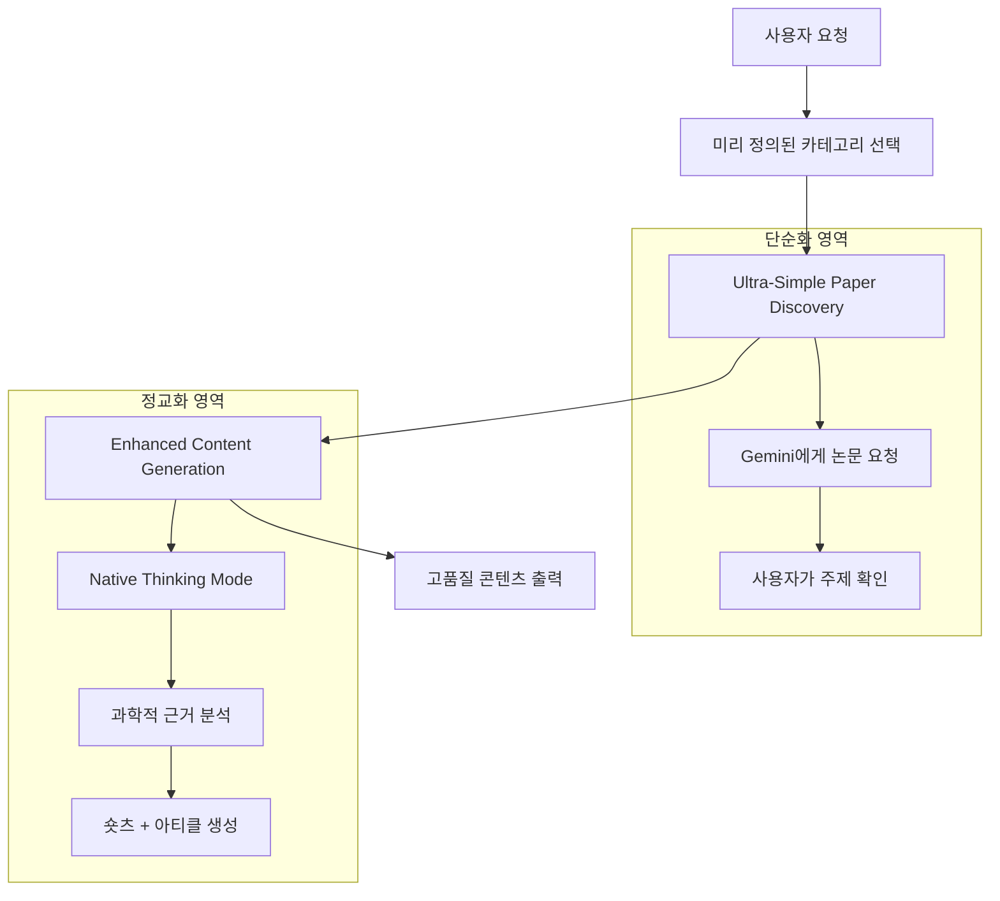
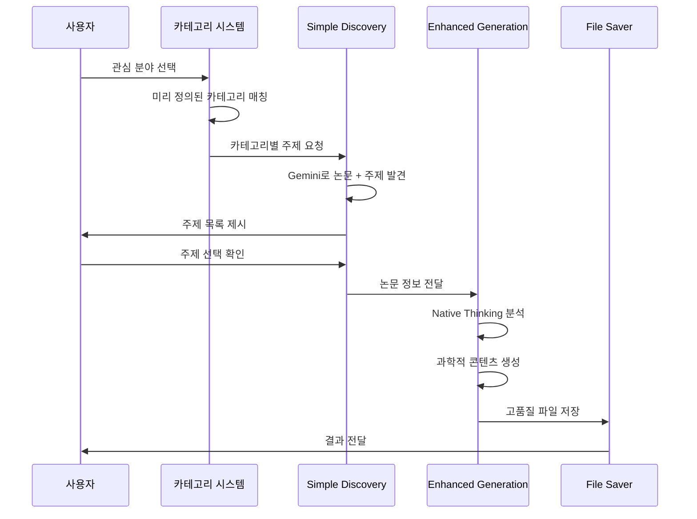

# 🔄 하이브리드 Paper-Based Content System v5.0 설계서

## 1. 시스템 개요

### 핵심 설계 원칙
- **논문 선정**: Ultra-Simple (Gemini 신뢰 기반)
- **콘텐츠 생성**: Enhanced (Native Thinking Mode 활용)
- **카테고리**: 계층적 구조 + 사용자 맞춤 확장

### 하이브리드 접근법


## 2. 통합 카테고리 시스템

### 메인 카테고리 구조 (10개)

#### 기본 운동 카테고리 (5개)
```
💪 근성장 & 근력 (Muscle Growth & Strength)
🔥 다이어트 & 체지방감소 (Diet & Fat Loss)
🍽️ 식단 & 영양 (Nutrition & Diet)
🏃 운동방법 & 기법 (Exercise Methods & Techniques)
📋 운동계획 & 설계 (Workout Planning & Design)
```

#### 확장 카테고리 (5개)
```
🧘 회복 & 컨디셔닝 (Recovery & Conditioning)
🧠 멘탈 & 동기부여 (Mindset & Motivation)
🚑 부상 방지 & 재활 (Injury Prevention & Rehab)
💡 운동 장비 & 보조제 (Gear & Supplements)
👩‍🏫 특정 그룹별 맞춤 정보 (For Specific Groups)
```

### 📝 Gemini 자유 주제 생성 방식
- **세부 주제 미리 정의하지 않음** ✅
- **Gemini가 창의적으로 트렌딩 주제 생성** ✅
- **사람들이 관심 가질만한 내용 자동 발굴** ✅
- **카테고리는 방향성만 제시, 구체적 주제는 AI 생성** ✅

### 예시 주제 생성 (참고용)
각 카테고리에서 Gemini가 생성할 수 있는 흥미로운 주제 예시:
- 💪 "새벽 운동 vs 저녁 운동, 근성장에 더 효과적인 시간은?"
- 🔥 "물만 마셔도 살빠진다? 냉수 다이어트의 과학적 근거"
- 🍽️ "치킨 브레스트 vs 닭다리, 근육에 더 좋은 부위는?"
- 🏃 "스쿼트 깊이에 따른 근육 자극 차이"
- 📋 "주 3회 vs 주 6회, 최적의 운동 빈도는?"

## 3. 하이브리드 시스템 아키텍처

### 시스템 컴포넌트

```python
class HybridPaperContentSystem:
    """
    하이브리드 논문 기반 콘텐츠 시스템
    - 논문 발견: Ultra-Simple
    - 콘텐츠 생성: Enhanced
    """
    
    def __init__(self):
        # Ultra-Simple 컴포넌트
        self.simple_paper_discovery = UltraSimplePaperDiscovery()
        
        # Enhanced 컴포넌트  
        self.enhanced_analyzer = EnhancedPaperAnalyzer()
        self.enhanced_generator = EnhancedContentGenerator()
        self.enhanced_saver = EnhancedFileContentSaver()
        
        # 새로운 카테고리 시스템
        self.category_system = IntegratedCategorySystem()
```

### 통합 워크플로우



## 4. 구현 계획

### Phase 1: 카테고리 시스템 구축
```python
# 1. 통합 카테고리 정의
INTEGRATED_CATEGORIES = {
    "💪 근성장 & 근력": {
        "subcategories": [
            "점진적 과부하 원칙",
            "근비대 메커니즘", 
            "근력 향상 프로그램",
            "근육별 특화 운동",
            "호르몬과 근성장"
        ],
        "target_keywords": ["근성장", "근력", "muscle", "strength", "hypertrophy"]
    },
    # ... 전체 10개 카테고리 정의
}
```

### Phase 2: Ultra-Simple Discovery 통합 (논문 없음 자동 스킵)
```python
class UltraSimplePaperDiscovery:
    def discover_paper_based_topics(self, predefined_category, target_count=5):
        """미리 정의된 카테고리 기반 논문 발견 + 자동 스킵 시스템"""
        category_info = INTEGRATED_CATEGORIES[predefined_category]
        
        attempts = 0
        max_attempts = 15  # 최대 15번 시도
        valid_topics = []
        
        while len(valid_topics) < target_count and attempts < max_attempts:
            # Gemini에게 논문 기반 주제 요청
            response = self.request_topics_with_papers(predefined_category)
            
            # 논문이 있는 주제만 필터링
            paper_based_topics = self.filter_topics_with_valid_papers(response)
            valid_topics.extend(paper_based_topics)
            
            attempts += 1
            
        return valid_topics[:target_count]
    
    def request_topics_with_papers(self, predefined_category):
        """논문과 함께 주제 요청"""
        prompt = f"""
        {predefined_category} 분야에서 **반드시 구체적인 논문과 함께**
        흥미로운 주제 7-10개를 제안해주세요.
        
        ⚠️ 중요: 논문이 없는 주제는 절대 포함하지 마세요.
        
        각 주제는 다음 형식으로:
        1. 주제명: [구체적 주제]
        2. 논문: [정확한 논문 제목 및 저자]
        3. 흥미포인트: [20-40대가 관심 가질 요소]
        
        예시:
        주제명: 근력 운동 시 점진적 과부하 원칙의 최적화
        논문: "Progressive overload without progressing load? The effects of load or repetition progression on muscular adaptations"
        흥미포인트: 무게를 늘리지 않고도 근성장을 극대화하는 비밀
        """
        
        return self.model.generate_content(prompt)
    
    def filter_topics_with_valid_papers(self, topics_response):
        """논문이 확실히 있는 주제만 선별"""
        valid_topics = []
        
        no_paper_indicators = [
            "논문을 찾기 어렵", "구체적인 논문이 없",
            "연구가 부족", "논문 제목을 제시하기 어렵",
            "관련 논문이 제한적", "정확한 논문을 찾을 수 없"
        ]
        
        for topic in topics_response:
            # 논문 없음 표시가 있으면 스킵
            if any(indicator in topic.content for indicator in no_paper_indicators):
                continue
                
            # 논문 제목이 명시되어 있으면 유효
            if self.has_valid_paper_title(topic):
                valid_topics.append(topic)
        
        return valid_topics
    
    def has_valid_paper_title(self, topic):
        """유효한 논문 제목이 있는지 확인"""
        paper_indicators = [
            "논문:", "Paper:", "Study:", "Research:",
            "Journal:", "et al.", "(20", "doi:"
        ]
        
        return any(indicator in topic.content for indicator in paper_indicators)
```

### Phase 3: Enhanced Generation 활용
```python
class EnhancedContentGenerator:
    def generate_with_category_context(self, topic, papers, category):
        """카테고리 컨텍스트를 반영한 콘텐츠 생성"""
        
        category_context = INTEGRATED_CATEGORIES[category]
        
        # Native Thinking Mode로 카테고리별 특화 콘텐츠 생성
        enhanced_prompt = f"""
        카테고리: {category}
        주제: {topic}
        타겟 키워드: {category_context['target_keywords']}
        
        위 정보를 바탕으로 해당 카테고리에 최적화된 콘텐츠를 생성하세요.
        """
        
        return self.native_thinking_generate(enhanced_prompt)
```

## 5. 사용자 경험 플로우

### 개선된 UX
```
1. 사용자 시작
   ↓
2. 10개 카테고리 중 선택
   💪 근성장 & 근력
   🔥 다이어트 & 체지방감소
   🍽️ 식단 & 영양
   🏃 운동방법 & 기법
   📋 운동계획 & 설계
   🧘 회복 & 컨디셔닝
   🧠 멘탈 & 동기부여
   🚑 부상 방지 & 재활
   💡 운동 장비 & 보조제
   👩‍🏫 특정 그룹별 맞춤 정보
   ↓
3. Gemini 자유 창작 주제 발굴 + 자동 스킵
   - 카테고리만 제시, 세부주제는 미리 정하지 않음
   - Gemini가 창의적으로 흥미로운 주제 생성
   - **논문 없는 주제 자동 스킵** (최대 15번 시도)
   - **오직 논문 기반 주제만** 사용자에게 제시
   - 트렌딩하고 사람들이 관심 가질만한 내용 자동 발굴
   - 사용자가 가장 흥미로운 주제 1개 선택
   ↓
4. Enhanced Content Generation
   - Native Thinking Mode로 논문 분석
   - 과학적 근거 강화 숏츠 + 아티클 생성
   ↓
5. 고품질 결과물
   - 카테고리별 특화된 콘텐츠
   - 논문 인용과 신뢰도 확보
   - 개별 파일로 체계적 저장
```

## 6. 기술적 장점

### Ultra-Simple + Enhanced 결합 효과
1. **빠른 논문 발견**: 복잡한 검증 없이 Gemini 신뢰
2. **정교한 분석**: Native Thinking Mode로 깊이 있는 분석  
3. **카테고리 특화**: 10개 분야별 맞춤 콘텐츠
4. **과학적 신뢰도**: 실제 논문 인용 + AI 검증
5. **확장성**: 새로운 카테고리 쉽게 추가 가능

### 🚀 논문 없음 자동 스킵 메커니즘
- **Paper-First 원칙 100% 고수**: 논문이 없는 주제는 절대 콘텐츠 생성하지 않음
- **자동 필터링**: 논문 없음 표시 자동 감지 및 제외
- **대안 주제 탐색**: 최대 15번 시도로 충분한 논문 기반 주제 확보
- **품질 보장**: 모든 콘텐츠가 실제 논문에 기반하여 높은 신뢰도 유지

### 기존 시스템 대비 개선점
- ✅ 논문 선정 단순화 (v4 Ultra-Simple 방식)
- ✅ 콘텐츠 생성 정교화 (v2 Native Thinking 방식)
- ✅ 카테고리 시스템 확장 (기존 4개 → 10개)
- ✅ 사용자 맞춤형 경험 (그룹별 특화)
- ✅ **논문 없음 자동 스킵** (가짜논문 생성 100% 방지)
- ✅ **엄격한 품질 관리** (Paper-First 원칙 철저 준수)

## 7. 예상 성과

### 콘텐츠 품질
- **다양성**: 10개 카테고리로 광범위한 주제 커버
- **전문성**: 카테고리별 특화 콘텐츠  
- **신뢰도**: Ultra-Simple + Enhanced 결합으로 높은 신뢰도
- **실용성**: 그룹별 맞춤 정보로 실용성 극대화

### 사용자 만족도
- **선택의 편의**: 명확한 10개 카테고리
- **개인화**: 타겟 그룹별 맞춤 콘텐츠
- **신뢰성**: 논문 기반 + AI 검증
- **지속 사용**: 다양한 카테고리로 장기 활용

## 8. 다음 단계

### 즉시 구현 항목
1. **통합 카테고리 시스템 코드 작성**
2. **Ultra-Simple Discovery 수정**  
3. **Enhanced Generator 카테고리 통합**
4. **통합 테스트 및 검증**

### 향후 확장 계획
1. **AI 자동 카테고리 매칭**
2. **사용자 선호도 학습**
3. **카테고리별 성과 분석**
4. **새로운 카테고리 자동 제안**

---

## 결론

하이브리드 Paper-Based Content System v5.0은 **"논문 선정 단순화 + 콘텐츠 생성 정교화"** 라는 사용자 요구사항을 완벽히 구현하면서, 동시에 **10개 통합 카테고리 시스템**으로 사용자 경험을 혁신적으로 개선하는 설계입니다.

특히 사용자가 제안한 5개 확장 카테고리(회복&컨디셔닝, 멘탈&동기부여, 부상방지&재활, 운동장비&보조제, 특정그룹별맞춤정보)는 기존 시스템의 범위를 크게 확장하여 더욱 종합적이고 실용적인 콘텐츠 생성을 가능하게 합니다.

이제 이 설계를 바탕으로 실제 Python 코드 구현을 진행할 준비가 완료되었습니다! 🚀