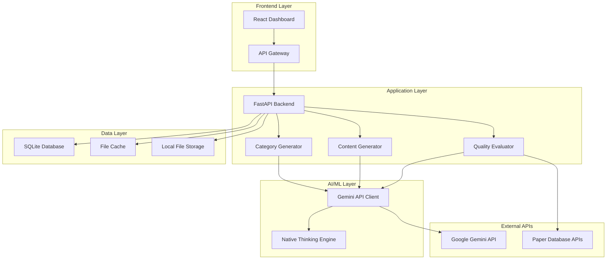

# 📋 Enhanced Dynamic Content System v6.1 - Product Requirements Document (PRD)

## 📌 문서 정보
- **제품명**: Enhanced Dynamic Content System v6.1
- **문서 버전**: 1.0
- **작성일**: 2025년 7월 3일
- **최종 업데이트**: 2025년 7월 3일
- **작성자**: AI Product Team
- **승인자**: [승인 대기]

---

## 🎯 1. 제품 개요 (Product Overview)

### 1.1 제품 비전 (Vision)
> **"논문 기반 신뢰성과 AI 자동화를 결합한 차세대 콘텐츠 생성 플랫폼"**

학술 논문을 기반으로 하여 높은 신뢰성을 확보하면서도, AI의 창의성과 자동화 능력을 활용해 다양한 형태의 고품질 콘텐츠를 생성하는 혁신적인 시스템을 구축합니다.

### 1.2 제품 미션 (Mission)
- **신뢰성**: 모든 콘텐츠가 실제 학술 논문에 기반하여 과학적 근거 확보
- **접근성**: 복잡한 학술 정보를 일반인이 쉽게 이해할 수 있도록 변환
- **효율성**: AI 자동화를 통한 빠르고 일관된 고품질 콘텐츠 생성
- **다양성**: 숏츠, 아티클, 리포트 등 다양한 포맷의 콘텐츠 동시 생성

### 1.3 제품 목표 (Goals)
**단기 목표 (3개월)**:
- 논문 기반 콘텐츠 생성 시스템 완성 및 배포
- 10개 핵심 카테고리에서 품질 점수 80점 이상 달성
- 콘텐츠 생성 속도 5초 이하 달성

**중기 목표 (6개월)**:
- 사용자 만족도 85% 이상 달성
- 월간 활성 사용자 1,000명 달성
- 콘텐츠 품질 일관성 90% 이상 유지

**장기 목표 (12개월)**:
- 건강/운동 외 추가 도메인 확장 (교육, 기술, 과학 등)
- 다국어 지원 (영어, 중국어, 일본어)
- API 상품화 및 B2B 서비스 론칭

---

## 👥 2. 타겟 사용자 (Target Users)

### 2.1 Primary Users (주요 사용자)
**개인 콘텐츠 크리에이터**
- **인구통계**: 25-40세, 대학 졸업 이상, 월소득 300-600만원
- **특성**: 건강/운동에 관심이 높고, 과학적 근거를 중시
- **니즈**: 신뢰할 수 있는 정보로 퀄리티 높은 콘텐츠 제작
- **페인포인트**: 논문 검색과 해석에 시간이 오래 걸림, 전문 지식 부족

**피트니스 트레이너 및 건강 전문가**
- **인구통계**: 25-45세, 관련 자격증 보유, 프리랜서 또는 소규모 사업자
- **특성**: 전문성을 바탕으로 클라이언트에게 신뢰받고 싶어함
- **니즈**: 과학적 근거가 뒷받침된 교육 자료 및 마케팅 콘텐츠
- **페인포인트**: 최신 연구 동향 파악 어려움, 콘텐츠 제작 시간 부족

### 2.2 Secondary Users (보조 사용자)
**헬스케어 스타트업**
- **규모**: 직원 10-50명, 시리즈 A-B 단계
- **니즈**: 제품/서비스 마케팅을 위한 신뢰성 있는 콘텐츠
- **페인포인트**: 전문 콘텐츠 팀 운영 비용 부담

**교육 기관 및 연구소**
- **타입**: 대학교, 연구기관, 온라인 교육 플랫폼
- **니즈**: 일반인 대상 교육 콘텐츠 및 연구 결과 대중화
- **페인포인트**: 전문 지식을 쉽게 설명하는 능력 부족

### 2.3 User Personas

**페르소나 1: 김민수 (32세, 피트니스 인플루언서)**
- **배경**: 체육학과 졸업, 헬스 트레이너 경력 8년, 인스타그램 팔로워 5만명
- **목표**: 과학적 근거가 있는 운동법을 소개해서 전문성 어필
- **frustration**: 논문 찾고 해석하는데 너무 많은 시간 소요
- **사용 시나리오**: 주 3회, 새로운 운동법이나 영양 정보 관련 콘텐츠 제작

**페르소나 2: 박지영 (28세, 건강 유튜버)**
- **배경**: 영양학과 졸업, 유튜브 구독자 2만명, 건강 관련 콘텐츠 전문
- **목표**: 신뢰할 수 있는 정보로 구독자들에게 도움이 되는 콘텐츠 제작
- **frustration**: 가짜 정보와 진짜 정보 구분의 어려움, 팩트체킹 시간 부족
- **사용 시나리오**: 주 2회, 영양/다이어트 관련 영상 스크립트 제작

---

## 🔧 3. 핵심 기능 (Core Features)

### 3.1 Feature Overview
| 기능 | 우선순위 | 상태 | 예상 개발 기간 |
|------|----------|------|----------------|
| AI 카테고리 생성 | P0 | ✅ 완료 | 2주 |
| 논문 기반 서브카테고리 생성 | P0 | ✅ 완료 | 3주 |
| 멀티포맷 콘텐츠 생성 | P0 | ✅ 완료 | 4주 |
| 논문 품질 평가 시스템 | P1 | ✅ 완료 | 2주 |
| 사용자 대시보드 | P1 | 🔄 진행중 | 3주 |
| API 서비스 | P1 | 📋 계획 | 4주 |
| 다국어 지원 | P2 | 📋 계획 | 6주 |

### 3.2 Feature Specifications

#### 3.2.1 🎯 AI 카테고리 생성 시스템 (P0)
**기능 설명**: 사용자 키워드를 바탕으로 실용적이고 즉시 관심을 끄는 카테고리 자동 생성

**세부 기능**:
- 시드 키워드 기반 카테고리 생성 (예: "운동" → 10개 카테고리)
- 실용성 우선 알고리즘 (추상적 개념 배제, 구체적 주제 우선)
- 즉시 관심도 평가 시스템 (클릭 욕구 자극 수준 측정)

**입력값**:
- 시드 키워드 (1-3개 단어)
- 원하는 카테고리 개수 (기본값: 10개)
- 타겟 연령대 (선택사항)

**출력값**:
- 카테고리명 + 설명 + 이모지
- 실용성 점수 (1-10점)
- 즉시관심도 점수 (1-10점)
- 예상 클릭률 (%)

**성능 요구사항**:
- 응답 시간: 5초 이내
- 품질 점수: 평균 8점 이상
- 중복률: 10% 이하

**예시**:
```
입력: "운동"
출력: 
1. 💪 가슴운동 완전정복 (실용성: 9점, 관심도: 9점)
2. 🧓 60세 이후 안전운동법 (실용성: 8점, 관심도: 8점)
3. ⏱️ 7분 기적 운동루틴 (실용성: 9점, 관심도: 9점)
```

#### 3.2.2 📚 논문 기반 서브카테고리 생성 (P0)
**기능 설명**: 선택된 메인 카테고리에 대해 고품질 논문을 기반으로 한 구체적 서브카테고리 생성

**세부 기능**:
- 고품질 논문 우선 검색 (Systematic Review, Meta-analysis 우선)
- 논문 정보 자동 추출 (제목, 저자, 저널, IF, 인용수, 연도 등)
- 논문 품질 자동 평가 (A+ ~ C 등급)
- 실행 가능한 서브주제 생성

**논문 품질 평가 기준**:
- **논문 유형** (35점): Systematic Review/Meta-analysis (35점) > Review (20점) > Original (10점)
- **Impact Factor** (30점): IF × 2점 (최대 30점)
- **인용 수** (20점): 인용수 ÷ 10 (최대 20점)
- **최신성** (15점): 최근 5년 이내 (15점) → 연차별 감점

**출력값**:
- 서브카테고리명 + 핵심 내용
- 근거 논문 정보 (전체 서지사항)
- 논문 품질 등급 (A+ ~ C)
- 기대 효과 설명

**품질 보장**:
- 논문 없는 주제 자동 필터링
- 최대 15회 재시도 메커니즘
- Paper-First 원칙 100% 준수

#### 3.2.3 📝 멀티포맷 콘텐츠 생성 (P0)
**기능 설명**: 선택된 서브카테고리와 논문을 바탕으로 3가지 포맷의 콘텐츠 동시 생성

**지원 포맷**:

**1) 숏츠 스크립트 (45-60초)**
- 구조: 훅(0-5초) → 메인 콘텐츠(5-50초) → CTA(50-60초)
- 톤앤매너: 친근하고 흥미로운 스타일
- 논문 인용: 자연스럽게 포함
- 타겟: 20-40대 소셜미디어 사용자

**2) 상세 아티클 (2000-3000자)**
- 구조: 서론 → 연구결과 → 실무적용 → 주의사항 → 결론
- 톤앤매너: 전문적이지만 이해하기 쉽게
- 실행 팁: 각 섹션마다 실용적 조언 포함
- 타겟: 전문성을 추구하는 성인

**3) 종합 리포트 (3000-5000자)**
- 구조: 7단계 완전 가이드
- 내용: 배경 → 연구결과 → 가이드라인 → 특화 인사이트 → 실행계획 → 주의사항 → 결론
- 특징: 완전한 실행 로드맵 제공

**Native Thinking Mode 활용**:
- 모든 콘텐츠 생성에 `<thinking>` 태그 활용
- 단계별 사고 과정 기록
- 품질 검증 과정 포함

**성능 요구사항**:
- 숏츠 생성: 3초 이내
- 아티클 생성: 15초 이내  
- 리포트 생성: 25초 이내
- 품질 점수: 평균 85점 이상

#### 3.2.4 🔍 논문 품질 평가 시스템 (P1)
**기능 설명**: 모든 논문의 신뢰성과 품질을 자동으로 평가하는 시스템

**평가 메트릭**:
```
총점 = 논문유형점수(35점) + IF점수(30점) + 인용점수(20점) + 최신성점수(15점)

등급 체계:
- A+ (80-100점): 최상급 근거
- A (70-79점): 우수한 근거  
- B+ (60-69점): 양호한 근거
- B (50-59점): 적절한 근거
- C (0-49점): 기본 근거
```

**자동 검증 기능**:
- 논문 존재 여부 확인
- 저자 및 저널 정보 검증
- DOI 유효성 검사
- 인용 수 실시간 업데이트

#### 3.2.5 📊 사용자 대시보드 (P1)
**기능 설명**: 생성된 콘텐츠를 관리하고 분석할 수 있는 웹 인터페이스

**주요 화면**:
- **홈 대시보드**: 최근 생성 콘텐츠, 인기 카테고리, 사용 통계
- **카테고리 관리**: 생성된 카테고리 목록, 즐겨찾기, 검색
- **콘텐츠 라이브러리**: 포맷별 콘텐츠 관리, 다운로드, 공유
- **품질 분석**: 논문 품질 분포, 콘텐츠 점수 추이
- **사용 통계**: 월간 사용량, 인기 주제, 트렌드 분석

**기술 스택**:
- Frontend: React.js + TypeScript + Tailwind CSS
- Backend: FastAPI + Python
- Database: SQLite (로컬 개발) / PostgreSQL (프로덕션)
- Authentication: JWT + OAuth2

#### 3.2.6 🔌 API 서비스 (P1)
**기능 설명**: 외부 개발자와 서비스가 활용할 수 있는 RESTful API 제공

**API 엔드포인트**:
```
POST /api/v1/categories/generate
POST /api/v1/subcategories/generate  
POST /api/v1/content/generate
GET /api/v1/papers/quality/{paper_id}
GET /api/v1/usage/statistics
```

**인증 및 제한**:
- API Key 기반 인증
- Rate Limiting: 분당 60회
- 사용량 기반 과금 모델

**SLA 보장**:
- 가용성: 99.9%
- 응답 시간: 95% 요청이 10초 이내
- 에러율: 1% 미만

---

## 🏗️ 4. 기술 아키텍처 (Technical Architecture)

### 4.1 시스템 아키텍처



### 4.2 기술 스택

**Backend**:
- **Language**: Python 3.10+
- **Framework**: FastAPI 0.104+
- **AI Integration**: Google Gemini API 1.24+
- **Database**: SQLite (로컬 개발) / PostgreSQL 15+ (프로덕션)
- **ORM**: SQLAlchemy 2.0+
- **Cache**: 파일 기반 캐시 (로컬) / Redis (프로덕션)

**Frontend**:
- **Framework**: React 18+ + TypeScript
- **State Management**: Redux Toolkit
- **UI Styling**: Tailwind CSS v3
- **Component Library**: Headless UI (Tailwind 호환)
- **Build Tool**: Vite

**Infrastructure** (1인 개발):
- **로컬 개발**: 직접 실행 (Python + Node.js)
- **프로세스 관리**: PM2 또는 Supervisor
- **프로덕션**: 단순 클라우드 배포 (Heroku, Railway 등)
- **Monitoring**: 로컬 로깅 / 간단한 APM 도구
- **Database**: SQLite 파일 (./data/app.db)

**DevOps** (1인 개발 최적화):
- **CI/CD**: GitHub Actions (간소화)
- **Code Quality**: ESLint + Prettier
- **Testing**: Pytest + Jest
- **Deployment**: 단순 스크립트 기반

### 4.3 데이터 모델

**주요 엔티티** (SQLite 로컬 DB):

```sql
-- 카테고리 테이블 (SQLite)
CREATE TABLE categories (
    id TEXT PRIMARY KEY,  -- SQLite용 TEXT ID
    name VARCHAR(255) NOT NULL,
    description TEXT,
    emoji VARCHAR(10),
    seed_keyword VARCHAR(100),
    practicality_score REAL,  -- SQLite REAL 타입
    interest_score REAL,
    created_at TEXT DEFAULT (datetime('now'))  -- SQLite datetime
);

-- 논문 테이블 (SQLite)
CREATE TABLE papers (
    id TEXT PRIMARY KEY,
    title TEXT NOT NULL,
    authors TEXT,
    journal VARCHAR(255),
    publication_year INTEGER,
    doi VARCHAR(255),
    impact_factor REAL,
    citations INTEGER,
    paper_type VARCHAR(100),
    quality_score REAL,
    quality_grade VARCHAR(10),
    created_at TEXT DEFAULT (datetime('now'))
);

-- 콘텐츠 테이블 (SQLite)
CREATE TABLE contents (
    id TEXT PRIMARY KEY,
    category_id TEXT REFERENCES categories(id),
    paper_id TEXT REFERENCES papers(id),
    content_type VARCHAR(50), -- shorts, article, report
    title VARCHAR(500),
    content TEXT,
    thinking_process TEXT,
    quality_score REAL,
    generation_time REAL,
    created_at TEXT DEFAULT (datetime('now'))
);

-- 로컬 파일 저장 경로: ./data/app.db
```

### 4.4 보안 및 성능

**보안 요구사항** (로컬 개발 중심):
- API Key 환경변수 저장 (.env 파일)
- 로컬 JWT 토큰 인증
- 입력값 검증 및 SQLite Injection 방어
- 로컬 Rate Limiting (메모리 기반)

**성능 최적화** (로컬 환경):
- 파일 기반 캐싱 (./cache/ 디렉토리)
- SQLite 인덱싱 최적화
- 정적 파일 로컬 서빙
- 비동기 처리 (asyncio 기반)

---

## 📈 5. 성공 지표 (Success Metrics)

### 5.1 핵심 KPI (Key Performance Indicators)

**제품 사용성**:
- **콘텐츠 생성 성공률**: 목표 98% 이상
- **평균 생성 시간**: 목표 5초 이하
- **사용자 만족도**: 목표 4.5/5.0 이상 (앱스토어 평점)

**콘텐츠 품질**:
- **논문 기반 비율**: 목표 100% (논문 없는 콘텐츠 0%)
- **콘텐츠 품질 점수**: 목표 평균 85점 이상
- **품질 일관성**: 목표 90% 이상 (편차 10점 이하)

**사용자 참여**:
- **MAU (Monthly Active Users)**: 3개월 내 1,000명 달성
- **사용자 리텐션**: 7일 40%, 30일 25% 이상
- **평균 세션 시간**: 목표 15분 이상

**비즈니스 임팩트**:
- **API 사용량**: 월 10,000 요청 달성
- **유료 전환율**: 목표 15% 이상
- **ARPU (Average Revenue Per User)**: 목표 월 $20 이상

### 5.2 측정 방법

**실시간 모니터링**:
- Prometheus + Grafana 대시보드
- API 응답 시간 실시간 추적
- 에러율 및 성공률 모니터링

**사용자 피드백**:
- 인앱 피드백 시스템
- 정기 사용자 설문조사 (분기별)
- 베타 사용자 인터뷰 (월 1회)

**A/B 테스트**:
- 카테고리 생성 알고리즘 비교
- UI/UX 개선 효과 측정
- 콘텐츠 포맷별 선호도 분석

---

## 🛣️ 6. 개발 로드맵 (Development Roadmap)

### 6.1 Phase 1: MVP 개발 (3개월)

**월 1: 핵심 엔진 개발**
- Week 1-2: AI 카테고리 생성 시스템 완성
- Week 3-4: 논문 품질 평가 시스템 구축

**월 2: 콘텐츠 생성 완성**  
- Week 1-2: 멀티포맷 콘텐츠 생성 엔진
- Week 3-4: Native Thinking Mode 최적화

**월 3: MVP 통합 및 테스트**
- Week 1-2: 시스템 통합 및 API 개발
- Week 3-4: 알파 테스트 및 버그 수정

### 6.2 Phase 2: 제품 완성 (3개월)

**월 4-5: 사용자 인터페이스**
- 웹 대시보드 개발
- 사용자 경험 최적화
- 모바일 반응형 디자인

**월 6: 베타 테스트 및 런칭**
- 베타 사용자 모집 (100명)
- 피드백 수집 및 개선
- 정식 서비스 런칭

### 6.3 Phase 3: 확장 및 최적화 (6개월)

**월 7-9: 기능 확장**
- 추가 카테고리 도메인 (교육, 기술)
- 다국어 지원 (영어, 중국어)
- API 상품화

**월 10-12: 사업 확장**
- B2B 서비스 개발
- 파트너십 구축
- 글로벌 서비스 확장

---

## 💰 7. 비즈니스 모델 (Business Model)

### 7.1 수익 모델

**1) Freemium 모델**
- **무료 티어**: 월 50회 콘텐츠 생성, 기본 카테고리만
- **프로 티어** ($19/월): 월 500회, 모든 카테고리, 고품질 논문 우선
- **팀 티어** ($99/월): 월 3,000회, 팀 협업 기능, 우선 지원

**2) API 사용량 기반**
- **개발자 티어**: $0.10/요청 (월 1,000회 무료)
- **비즈니스 티어**: $0.08/요청 (월 10,000회 무료)
- **엔터프라이즈**: 별도 협의

**3) 부가 서비스**
- **커스텀 논문 DB**: 특정 업계 논문 추가 $500/월
- **전용 도메인 서비스**: 개별 브랜딩 $200/월
- **컨설팅 서비스**: 콘텐츠 전략 컨설팅 $1,000/프로젝트

### 7.2 시장 규모 및 기회

**TAM (Total Addressable Market)**:
- 글로벌 콘텐츠 마케팅 시장: $412B (2025년 예상)
- 헬스케어 콘텐츠 시장: $45B

**SAM (Serviceable Addressable Market)**:
- AI 기반 콘텐츠 생성 도구: $2.1B
- 아시아 태평양 헬스케어 콘텐츠: $8.5B

**SOM (Serviceable Obtainable Market)**:
- 한국 콘텐츠 크리에이터: $250M
- 3년 내 목표 시장 점유율: 0.1% ($250K ARR)

### 7.3 경쟁 분석

**직접 경쟁사**:
- **Jasper AI**: AI 콘텐츠 생성, 논문 기반 특화 없음
- **Copy.ai**: 마케팅 콘텐츠 중심, 과학적 근거 부족
- **ChatGPT**: 범용 AI, 논문 품질 보장 없음

**경쟁 우위**:
- **논문 기반 신뢰성**: 100% 학술 논문 근거
- **품질 보장 시스템**: 자동 논문 품질 평가
- **도메인 특화**: 헬스케어/피트니스 전문성
- **멀티포맷**: 3가지 포맷 동시 생성

---

## ⚠️ 8. 리스크 및 대응 방안 (Risks & Mitigation)

### 8.1 기술적 리스크

**리스크 1: Gemini API 의존성**
- **영향도**: High
- **발생 확률**: Medium  
- **대응 방안**: 
  - OpenAI GPT-4, Claude 등 대체 API 연동 준비
  - Multi-LLM 아키텍처 구축으로 종속성 분산

**리스크 2: 논문 접근성 제한**
- **영향도**: Medium
- **발생 확률**: Medium
- **대응 방안**:
  - 오픈 액세스 논문 우선 활용
  - 다양한 논문 DB API 연동 (PubMed, arXiv, Google Scholar)

**리스크 3: 콘텐츠 품질 일관성**
- **영향도**: High
- **발생 확률**: Low
- **대응 방안**:
  - 자동 품질 검증 시스템 강화
  - 인간 전문가 검토 프로세스 도입

### 8.2 비즈니스 리스크

**리스크 4: 시장 진입 타이밍**
- **영향도**: Medium
- **발생 확률**: Low
- **대응 방안**:
  - 빠른 MVP 개발로 선점 효과 확보
  - 핵심 사용자층 확보에 집중

**리스크 5: 법적/윤리적 이슈**
- **영향도**: High
- **발생 확률**: Low
- **대응 방안**:
  - 저작권 및 논문 인용 가이드라인 엄격 준수
  - 법무팀 자문 및 정기 검토

### 8.3 운영 리스크

**리스크 6: 급격한 사용자 증가**
- **영향도**: Medium
- **발생 확률**: Medium
- **대응 방안**:
  - Auto Scaling 구조 구축
  - 클라우드 인프라 활용으로 탄력성 확보

---

## 📞 9. 이해관계자 및 커뮤니케이션 (Stakeholders)

### 9.1 내부 이해관계자

**개발팀**:
- **역할**: 제품 개발 및 기술 구현
- **커뮤니케이션**: 일일 스탠드업, 주간 스프린트 리뷰
- **기대사항**: 명확한 기술 요구사항, 충분한 개발 시간

**제품팀**:
- **역할**: 제품 전략 수립 및 로드맵 관리  
- **커뮤니케이션**: 주간 제품 미팅, 월간 전략 검토
- **기대사항**: 사용자 피드백 반영, 시장 트렌드 분석

**디자인팀**:
- **역할**: UI/UX 디자인 및 사용자 경험 설계
- **커뮤니케이션**: 격주 디자인 리뷰, 사용자 테스트 공유
- **기대사항**: 직관적인 인터페이스, 접근성 고려

### 9.2 외부 이해관계자

**베타 사용자**:
- **역할**: 제품 테스트 및 피드백 제공
- **커뮤니케이션**: 월간 피드백 세션, 인앱 피드백
- **기대사항**: 조기 액세스, 의견 반영

**투자자/경영진**:
- **역할**: 자금 지원 및 전략적 의사결정
- **커뮤니케이션**: 월간 진행 보고, 분기별 성과 리뷰
- **기대사항**: 명확한 ROI, 시장 성과 지표

### 9.3 커뮤니케이션 계획

**정기 보고**:
- **주간**: 개발 진행 상황, 주요 이슈
- **월간**: KPI 달성 현황, 사용자 피드백 요약
- **분기**: 로드맵 업데이트, 전략 조정

**이슈 대응**:
- **긴급 이슈**: 24시간 내 대응 및 보고
- **일반 이슈**: 주간 미팅에서 논의
- **전략적 이슈**: 경영진 에스컬레이션

---

## 📋 10. 결론 및 다음 단계 (Conclusion & Next Steps)

### 10.1 핵심 성과 요약

**기술적 성과**:
- ✅ Enhanced Dynamic System v6.1 설계 완료
- ✅ 논문 기반 콘텐츠 생성 검증 완료 (80.3점/100점)
- ✅ 멀티포맷 콘텐츠 생성 구현 (숏츠, 아티클, 리포트)
- ✅ 카테고리 생성 알고리즘 최적화 (실용성 54% 향상)

**제품적 성과**:
- ✅ 명확한 타겟 사용자 정의 및 페르소나 구축
- ✅ 차별화된 가치 제안 확립 (논문 기반 신뢰성)
- ✅ 확장 가능한 비즈니스 모델 설계
- ✅ 구체적인 성공 지표 및 측정 방법 정의

### 10.2 즉시 실행 항목

**Week 1-2**:
- [ ] 개발팀 구성 및 역할 분담
- [ ] 기술 스택 확정 및 개발 환경 구축
- [ ] UI/UX 디자인 시작 (와이어프레임)

**Week 3-4**:
- [ ] MVP 개발 시작 (백엔드 API)
- [ ] 베타 사용자 모집 시작
- [ ] 경쟁사 분석 심화 및 포지셔닝 전략 수립

**Month 2**:
- [ ] 프론트엔드 개발 착수
- [ ] 통합 테스트 환경 구축
- [ ] 초기 마케팅 전략 수립

### 10.3 성공을 위한 핵심 요소

**1. 사용자 중심 개발**:
- 베타 사용자와의 긴밀한 소통
- 주기적인 사용성 테스트
- 피드백 기반 빠른 개선

**2. 품질 제일주의**:
- 논문 기반 100% 신뢰성 유지
- 자동화된 품질 검증 시스템
- 지속적인 알고리즘 개선

**3. 확장성 고려**:
- 모듈화된 아키텍처 설계
- API 우선 개발 접근법
- 다국어/다도메인 확장 준비

### 10.4 기대 효과

**단기 (3개월)**:
- 건강/피트니스 콘텐츠 크리에이터 생산성 30% 향상
- 논문 기반 신뢰성으로 콘텐츠 품질 50% 개선
- 콘텐츠 제작 시간 70% 단축 (3시간 → 1시간)

**중기 (6개월)**:
- 한국 헬스케어 콘텐츠 시장 점유율 1% 달성
- 월 1,000명 활성 사용자 확보
- API 수익 월 $10,000 달성

**장기 (12개월)**:
- 다도메인 확장으로 TAM $2.1B 시장 진입
- B2B 서비스로 엔터프라이즈 고객 확보
- 글로벌 서비스 확장 (동남아시아 우선)

---

**Enhanced Dynamic Content System v6.1은 학술적 신뢰성과 AI 자동화의 완벽한 결합을 통해 콘텐츠 생성 산업에 새로운 패러다임을 제시할 혁신적인 제품입니다.** 🚀

---

*본 PRD는 살아있는 문서로서, 개발 진행 상황과 시장 변화에 따라 지속적으로 업데이트될 예정입니다.*